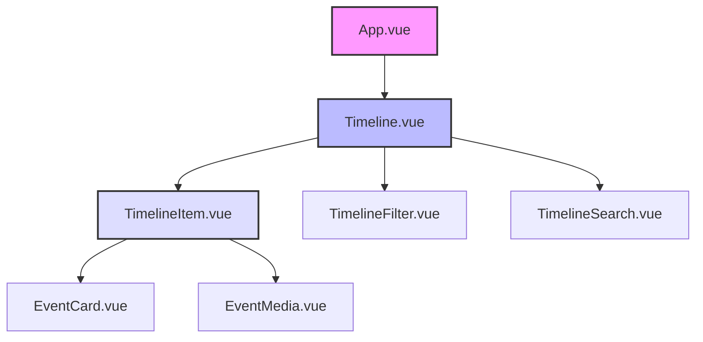
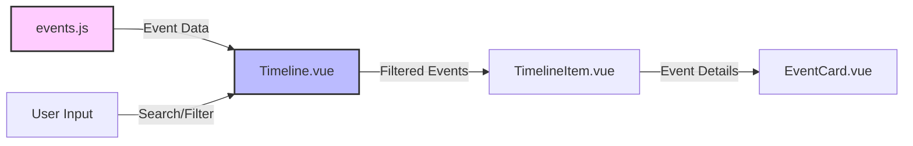
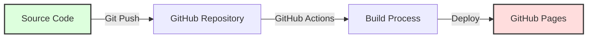

# AI Timeline 2022-Present

An interactive timeline showcasing major AI developments and milestones since 2022.

## Features

- Interactive timeline visualization
- Responsive design for all devices
- Smooth animations and transitions
- Comprehensive event data from 2022 onwards

## Project Architecture

### Component Structure



### Data Flow



### Directory Structure

```
ai-timeline/
├── src/                    # Source code
│   ├── components/        # Vue components
│   │   ├── TimelineItem.vue   # Individual timeline event
│   │   └── Timeline.vue       # Main timeline container
│   ├── assets/           # Static assets
│   │   └── styles/       # Global styles and CSS
│   ├── data/            # Timeline event data
│   │   └── events.js    # AI events database
│   ├── App.vue          # Root component
│   └── main.js          # Application entry point
├── public/              # Public static files
├── .github/             # GitHub configurations
│   └── workflows/       # GitHub Actions workflows
├── vite.config.js       # Vite configuration
└── package.json         # Project dependencies
```

### Deployment Flow



## Technology Stack

- **Frontend Framework**: Vue 3
- **Build Tool**: Vite
- **Styling**: CSS with animations
- **Deployment**: GitHub Pages
- **CI/CD**: GitHub Actions

## Development

1. Clone the repository
```bash
git clone https://github.com/chenhaiyun/ai-timeline-2022.git
cd ai-timeline-2022
```

2. Install dependencies
```bash
npm install
```

3. Start development server
```bash
npm run dev
```

4. Build for production
```bash
npm run build
```

## Responsive Design

The timeline is fully responsive and works on:
- Mobile devices
- Tablets
- Desktop computers

## Design Features

- Smooth scrolling animations
- Interactive event cards
- Visual indicators for timeline progression
- Consistent color scheme and typography

## Deployment

The project is automatically deployed to GitHub Pages through GitHub Actions workflow when changes are pushed to the main branch.

Visit the live site: [AI Timeline 2022](https://chenhaiyun.github.io/ai-timeline-2022/)

## License

MIT License
